# Community-Min-Language-Rime

# Rime Introduction
Rime is an IME engine that is very easy to use and even create your own dictionaries \
and schemas to start typing in your own language. The only one downside to this IME\
is that they don't display their services in english. \
So for non-mandarin speakers, just follow the instructions below\

## Windows PC Installation Guide
1. First you have to install the Rime Engine from  [Rime official website](https://rime.im/) \
Note: Focus on the word 小狼毫 with the window symbol on the left \
2. Run the installer\
3. Click on the agree button 我同意 as shown in the picture\
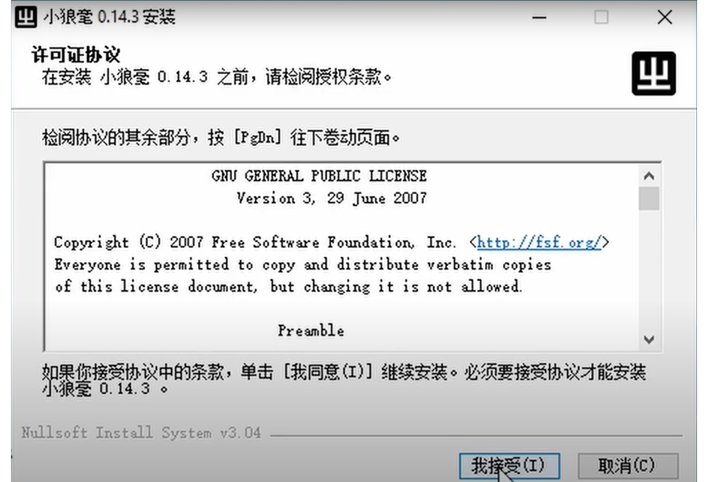\
4. Click on the button with 瀏覽/浏览 to select the folder where you want to install the Rime or just skip it to install on default folder\
5. Click on the button with the word 安裝 to install\
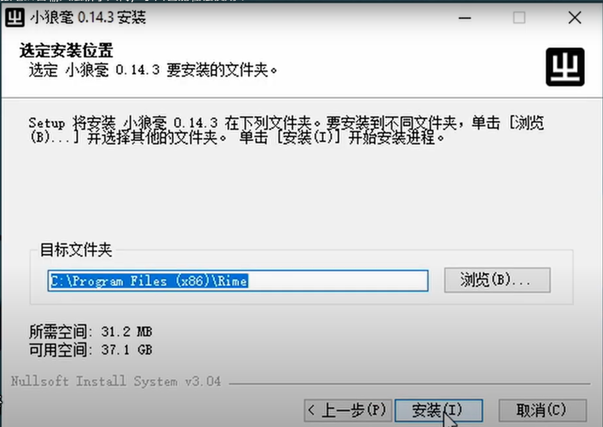\
6. A window will prompt our asking whether you want traditional characters or simplified you want to display (It does not really matter, but please choose the one displaying 中文（繁體，臺灣）as opposed being the one selected in the photos) \
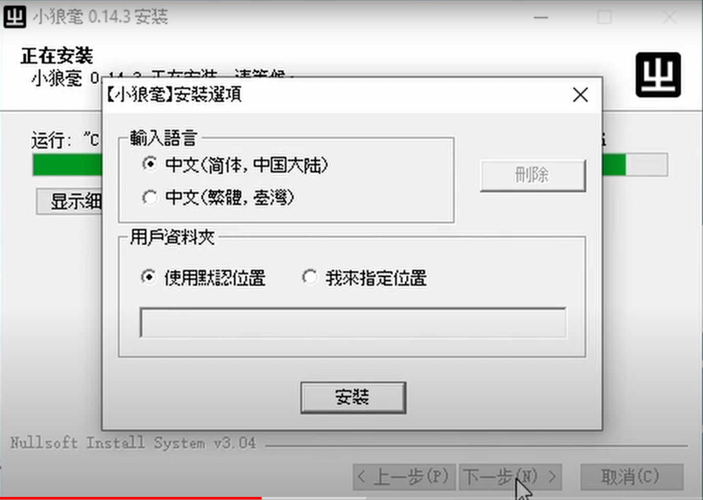\
7. Click on the button with 完成 and you are finished!\

## Macs Users Installation Guide
- Same as above but please download this file *[default.custom.yaml](https://github.com/loaden/rime/blob/master/default.custom.yaml).
- Modify the default.custom.yaml to include the .schema files you need
- Put it in the ~/Library/Rime
- Open the Squirrel App Content by right clicking on it where they display "Show content" in the installation folder
- Find default.custom.yaml under shared_support folder

## iPhone Installation Guide
1. install an app called iRime
2.  Go to this website https://github.com/Language-Preservation-Community/Community-Min-Language-Rime and download the Hokkien.schema and hokkien.dict
3. Open the iRime app, press on "PC Pass iRime"
4. There will be a number that shows on the screen, enter the number on your PC browser, it will then shows up an interface that allows you to upload files
5. Press on the SharedSupport Folder, then upload the Hokkien.schema and hokkien.dict
6. download the default.yaml and open the default.yaml with any texteditor, preferably notepad++
7. add a new schema named community_hokkien in the schema_list using the same format as previous.
8. Go to settings -> keyboard -> allow third party keyboard, select iRime then you can start using

## Importing new dictionaries and schemas\
1. First download the input schemas from the * [repo](https://github.com/Language-Preservation-Community/Community-Min-Language-Rime).\
(Press the green button labelled "Code" Then choose Download Zip\
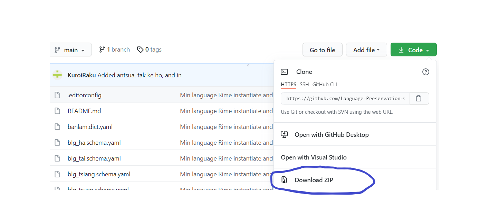\
2.Extract the Dictionary and the schema that you want to use (Hokkien, Teochew, Fuzhou etc) using Winrar or other software to any folder you want to place. And in this example, community hokkien is the one we want to choose\
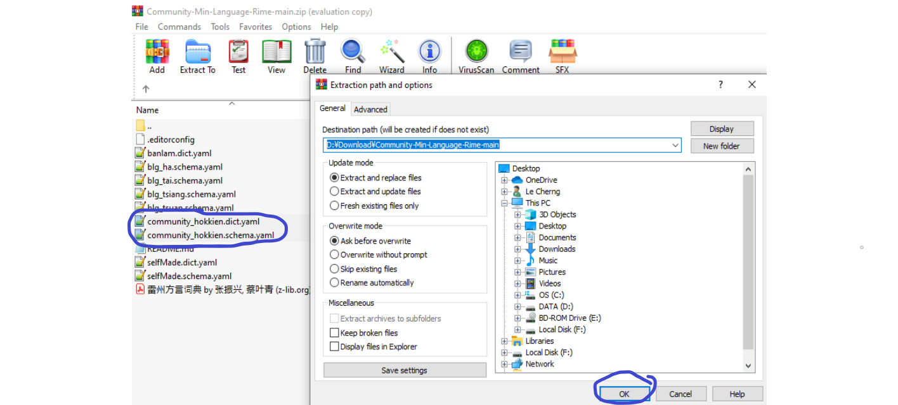\
3. Press Windows Key + Spacebar to switch to the new keyboard labaled “Chinese, 小狼毫\
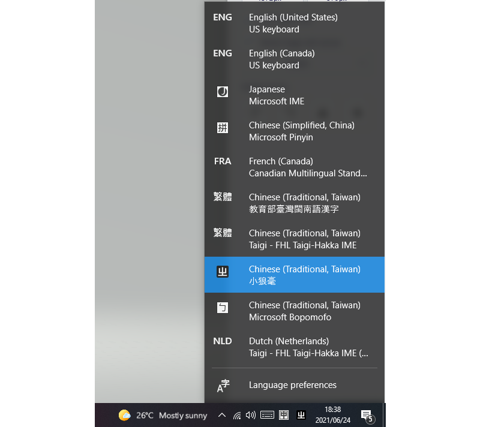\
4. Right click on the button that is labelled “中”on bottom right corner then click on the tab labeled "程序文件夾".\
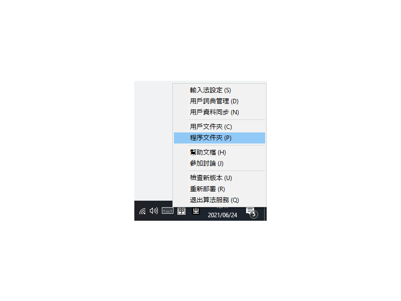
5. It should pop up the folder where you installed the program and press on the folder named "Data"\
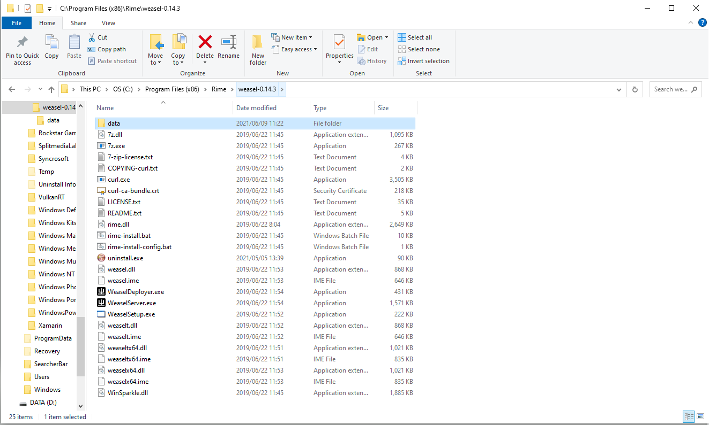\
6. Put the .dict files and .schema files to that folder\
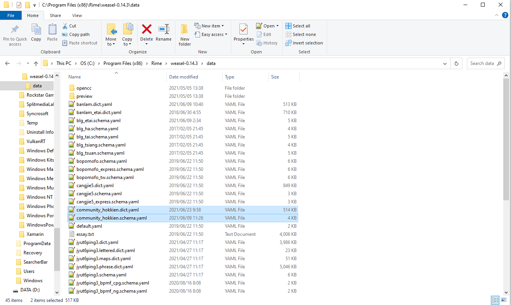\
7. Right click on the button labelled “中”on bottom right corner again, click on the tab labeled "輸入法設定"\
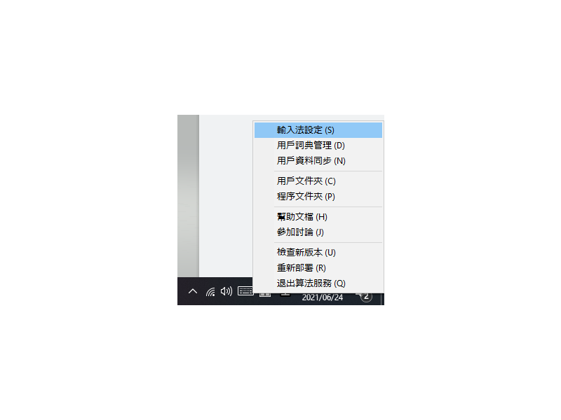\
8. A new window will open up, then it allows you to choose the keyboards you want to insert into. \
9. Tick on the keyboard you want to use and in this case, we will tick Hokkien.\
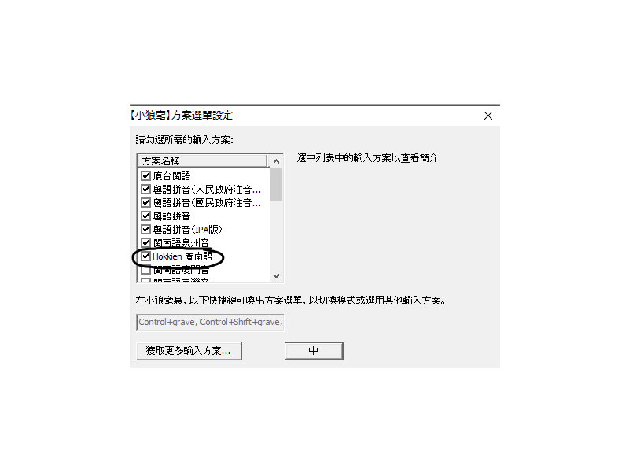\
10. Click on the button labelled "中"\
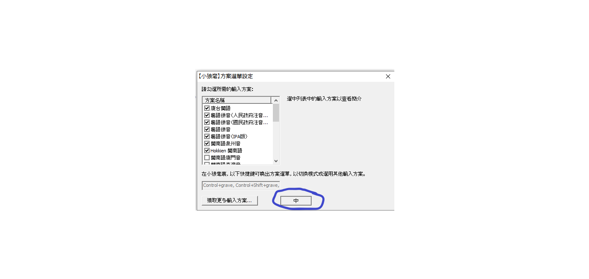\
11. Another window will pop out and asking what kind of style your keyboard want to display in, just pick whatever you want that you feels nice then click on the button labelled "中" again to start using new dictionaries and schemas\
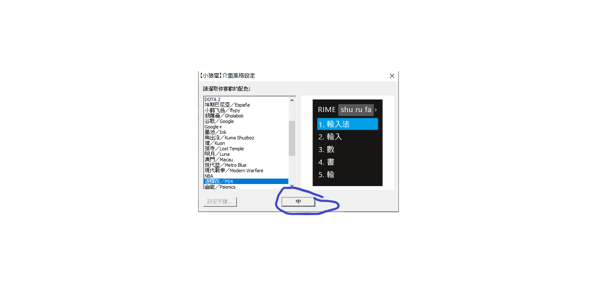\

## To start using the IME
1. Make sure you are in the correct IME which is labelled "Chinese 小狼毫" using Win key + spacebar\
2. To switch to the desired IME, press Ctrl + ` Button\   
3. After pressing Ctrl + `, go to the keyboard you decide to use. In my case it will be Hokkien.\
4. You can start typing!  (Use Switch to switch between English input and Chinese input)\

## To contribute to the dictionaries
1. Join the *[discord server](https://discord.gg/jEn9hCExj3 )\
2. After I grant you the permission to the repo, please download and install github, an app that allows programmer to work on the same project :D\
3. Go to the github website where the repo is and clone the repo by clicking on open with Github desktop. \
4. 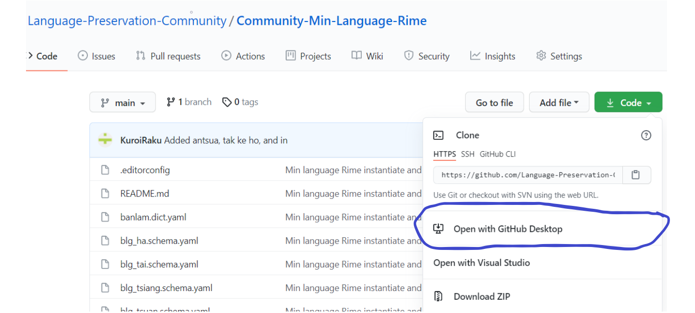  \
5. Clone the repo to any location on your PC (Make sure is not on C drive if possible).\
6. Open the folder where you cloned to, you can make changes to the dictionary there. Github desktop will be able to detect the changes.\
7. Once you finish implementing the changes, you will see on github desktop where all the changes are detecked. You need to write a commit saying what words you added then press on commit to main.\
8. Finally you will see something on Push Origin, press on the button to finally commit to the repo and people able to see!\

## To edit the dictionary 
1. You either get newest edition of the dictionary from the repo or you make the changes yourself to the dict.yamlin the data folder\
(The main concept you need to know that the changes you made are done to the .dict.yaml files in the data folder where your Rime program is installed).\
2. After you made the changes to the dict.yaml files (for mine it will be community_hokkien.dict.yaml, and I will just need to copy and paste from the github folder), right click on the button on the bottom right hand corner labelled with "中" again, and press the tab labelled with "重新部署" and the changes you made to the dictionary will be reflected\
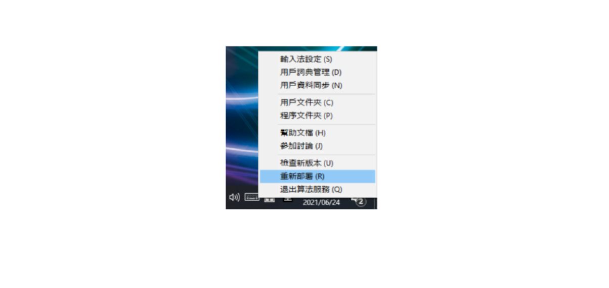\

*Remember to test your dictionary first before pushing!*\
*Remember to copy and paste from previous entry to prevent error*\
*Try to use notepad++ since this application handles larger number of words than regular notepad*\
*Sometimes it might be the bug of the application itself and your changes aren't reflected, and you might need to remove the dictionary from the data folder and make sure it uninstalls the dictionary through opening out and put the dictionary back into data folder again"\

## Original Authors
Credit to the original authors who set up the dictionaries and schemas\
Teochew Authors *[kahaani Tenda Huang](https://kahaani.github.io/dieghv )\ 
Hokkien Authots *[a-thok](https://github.com/a-thok/rime-hokkien)\
Fuzhounese Authors *[only3km Hector Sioh ](https://github.com/only3km/ciklinbekin)\  
